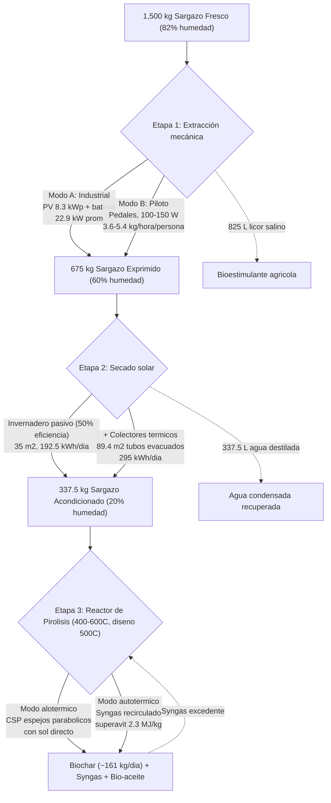

# PYRO_CELL — Diseño de Proceso (v2, corregido)

Resumen: Confirmar deadline real en Devpost (30 sept, confirmado, 9:00pm PDT). Track primario Track 2 (Data-to-Insight), secundario Track 6 (Resilience). Alcance MVP: calculadora energética + calculadora económica + dashboard de monitoreo simulado + módulo de validación IA. Repo público en GitHub. Setup en Vercel.

**Cambios respecto a v1:** la Etapa 1 (centrifugado) tenía un error físico (tracción a pedales especificada para un proceso que requiere 33 kW, cuando un humano sostiene 75-150 W). La Etapa 2 (invernadero) tenía un déficit energético no declarado (recibe 71% de la energía solar pasiva que necesita). Ambas se corrigen abajo con dos rutas concretas cada una.

---

## Balance de Materia (base corregida: 82% de humedad, Cheatham et al. 2026)

**Corrección respecto a versiones anteriores:** el balance usaba 80% de humedad inicial por error de redondeo. La cifra real citada de Cheatham et al. 2026 es 82%. Verificado y confirmado por `constantes.mlx` (script de Carlo, auditado y correcto).

| Etapa | Entrada | Salida sólida | Agua removida | Humedad final |
| --- | --- | --- | --- | --- |
| 1 | 1,500 kg fresco (82%) | 675 kg | 825 kg | 60% |
| 2 | 675 kg (60%) | 337.5 kg | 337.5 kg | 20% |
| 3 | 337.5 kg (20%) | → reactor de pirólisis | — | — |

Materia seca constante en las tres etapas: 270 kg.

---

## Etapa 1: Extracción Mecánica de Agua Libre

Remueve agua libre/superficial por fuerza centrífuga (825 kg de agua, de 82% a 60% de humedad). No remueve agua intracelular: eso queda para la Etapa 2.

### Modo A — Industrial (electrificado, escala de producción, 1,500 kg/día)

Ruta principal para operar a la escala que describe el proyecto.

- **Mecanismo:** centrífuga tipo decantadora, lotes de 100 kg cada 10 min, ciclo activo de 3-5 min a 2,000-3,000 RPM
- **Energía diaria:** 825 kg agua × 0.2 MJ/kg = 165 MJ = **45.83 kWh/día**
- **Potencia promedio** (repartida en la ventana de 2 horas, 08:00-10:00 AM): 22.9 kW
- **Potencia pico** (durante cada ciclo activo): proporcional a la nueva carga diaria, del orden de 36-62 kW según duración del ciclo
- **Fuente de energía:** arreglo fotovoltaico de **~8.3 kWp** (calculado con 5.5 kWh/m²/día, irradiación de la costa de Quintana Roo) + banco de batería que se carga en los 5-7 min de reposo entre lotes y descarga en la ráfaga de 3-5 min de spin activo
- **Fuentes:** intensidad energética de centrifugado industrial (~57.2 kWh/tonelada de agua removida, patentes USPTO citadas en la investigación); irradiación solar de Quintana Roo (Plan para el Fomento de Energías Renovables del Estado, 5.0-6.0 kWh/m²/día en la franja costera)

### Modo B — Piloto/Comunitario (tracción humana, escala reducida)

Ruta complementaria, no sustituta. Sirve como punto de entrada para comunidades sin electrificación o como demo de baja escala, nunca como reemplazo de la línea industrial.

- **Mecanismo:** centrífuga de tambor operada a pedales, con multiplicación de engranes (mismo principio que un extractor de miel manual, que alcanza 91.2% de eficiencia mecánica y 8.68 kg/hora de capacidad en la literatura revisada)
- **Potencia humana sostenida:** 100-150 W por persona
- **Rendimiento:**

| Potencia | Agua removida/hora | Sargazo fresco procesable/hora |
| --- | --- | --- |
| 100 W | 1.8 kg | 3.6 kg |
| 150 W | 2.7 kg | 5.4 kg |

- **Escala real:** para igualar un solo día de producción industrial (1,500 kg) se necesitarían del orden de cientos de persona-hora. No es viable como mecanismo de producción a la escala del proyecto; sí es honesto como narrativa de accesibilidad o como unidad piloto de demostración.

---

## Etapa 2: Secado Solar (Invernadero + Colectores Térmicos)

Remueve agua intracelular por evaporación (337.5 kg de agua, de 60% a 20% de humedad).

### Componente base: invernadero solar pasivo (sin cambios en área)

- Nave de 30-40 m² (35 m² como referencia), camas elevadas perforadas, ventilación forzada
- Temperatura interna: 45-60°C; velocidad de aire: 1.5 m/s
- **Decisión adoptada:** se aplica una eficiencia real de 50% al invernadero pasivo, no solo la energía teórica mínima. Un invernadero real no captura toda la radiación incidente como energía útil de evaporación (pérdidas por transmisión del plástico/vidrio, re-irradiación, convección) — este es el mismo criterio que ya usamos para justificar por qué los colectores térmicos son necesarios en primer lugar, aplicado ahora también al invernadero mismo, no solo al déficit.
- Energía teórica: 337.5 kg × 2.6 MJ/kg = 877.5 MJ = 243.75 kWh
- Energía real necesaria (con 50% de eficiencia): 877.5 / 0.50 = 1,755 MJ = **487.5 kWh**
- Energía solar pasiva disponible (35 m² × 5.5 kWh/m²/día) = **192.5 kWh/día**
- **Déficit: 295 kWh/día**

### Componente añadido: colectores solares térmicos de tubos evacuados

Cierra el déficit sin ampliar el invernadero ni extender la ventana de tiempo.

- **Tecnología:** tubos evacuados (rango de operación 80-140°C, apropiado para generar vapor de proceso sin necesidad de seguimiento solar)
- **Circuito:** cerrado, con fluido de transferencia térmica limpio (no el licor salino de la Etapa 1, que causaría incrustación y corrosión). El calor se transfiere al flujo de aire del invernadero vía intercambiador
- **Área necesaria:** 295 kWh / (5.5 kWh/m²/día × 0.60 de tasa de utilización) ≈ **89.4 m²**
- **Por qué térmico y no fotovoltaico:** los sistemas solares térmicos alcanzan tasas de utilización superiores al 60% en aplicaciones industriales, contra ~15% de un sistema fotovoltaico con resistencia eléctrica.
- **Fuentes:** eficiencias de colectores de tubos evacuados y comparación con fotovoltaico (literatura de calor de proceso solar industrial revisada en esta sesión)

### Resultado combinado

Invernadero (192.5 kWh) + colectores térmicos (295 kWh) = 487.5 kWh disponibles, exactamente lo necesario. El área total de la Etapa 2 sube a ~124.4 m² (35 m² invernadero + 89.4 m² colectores), notablemente mayor que en la versión sin penalización de eficiencia (que daba 15.5 m²). Este es el costo físico de modelar el invernadero con una eficiencia realista en vez de la captura teórica pura.

---

## Etapa 3: Transición y Calentamiento del Reactor de Pirólisis

El sargazo sale del invernadero a 40-50°C, precalentado, y entra directo a la tolva del reactor sin almacenamiento prolongado que reabsorba humedad ambiental costera.

**Temperatura de reactor: rango 400-600°C, con 500°C como punto de diseño óptimo.** Decisión adoptada considerando que la dispersión de calor real y una efectividad de transferencia menor al 100% hacen que un punto medio sea más realista que el extremo inferior del rango de Milledge et al. (400°C).

**Calor requerido, recalculado desde primeros principios** (arrancando desde 40°C precalentado, no desde 20°C frío como el cálculo original de Milledge et al., que no contemplaba nuestro propio diseño de precalentamiento en la Etapa 2):

```latex
Q_{pyro,500°C} = C_{p,sargassum} \times (500-40) = 1.3 \times 460 = 598\ \text{kJ/kg} = 0.598\ \text{MJ/kg}
```

| Temperatura | Q requerido (desde 40°C precalentado) |
| --- | --- |
| 400°C | 0.468 MJ/kg |
| **500°C (diseño)** | **0.598 MJ/kg** |
| 600°C | 0.728 MJ/kg |

**Superávit con el punto de diseño (500°C):** usando el rendimiento energético de syngas+bio-aceite de Milledge et al. (2.9 MJ/kg), que sigue siendo la única fuente disponible aunque fue medida a 400°C, no a 500°C:

```latex
E_{net,pyro} = 2.9 - 0.598 = 2.302\ \text{MJ/kg} \approx 621.5\ \text{MJ/día (270 kg)}
```

**Salvedad honesta:** el rendimiento de 2.9 MJ/kg es un dato experimental de Milledge et al. a 400°C específicamente. Usarlo a 500°C es una extrapolación, no una medición — en pirólisis real, el rendimiento de productos (biochar vs. bio-aceite vs. syngas) cambia con la temperatura, y no tenemos datos de Milledge et al. a 500°C para confirmar cuánto cambia exactamente.

**Rendimiento de biochar a 500°C, interpolado (no medido):** entre el 67.6% de Milledge et al. a 400°C y el 51.91% de Cheatham et al. a 600°C, una interpolación lineal da:

```latex
Y_{biochar}(500°C) \approx 59.8\% \Rightarrow 270 \times 0.598 = 161.3\ \text{kg/día de biochar}
```

Esta cifra es una estimación propia, no un dato citado — ningún estudio revisado reporta rendimiento de biochar de sargazo específicamente a 500°C.

### Arquitectura híbrida de calentamiento: CSP alotérmico + syngas autotérmico

- **Cuando hay sol directo:** un campo de espejos parabólicos o lentes Fresnel (CSP) aporta el calor primario al reactor (modo alotérmico)
- **Cuando no hay sol** (nublado, de noche, arranque): el propio syngas generado por la pirólisis se recircula y se quema para sostener la temperatura de reacción (modo autotérmico), aprovechando el superávit ya verificado de 2.4 MJ/kg (syngas + bio-aceite disponibles menos 0.5 MJ/kg necesarios para calentar el sargazo seco)
- El sistema pasa de un modo a otro sin interrumpir la producción

**Validación técnica:** un reactor prototipo de alimentación continua demostró operar tanto en modo alotérmico puro como en modo híbrido alotérmico/autotérmico bajo irradiación solar intermitente, con producción continua de syngas y buenos rendimientos (Energies 2020, DOI 10.3390/en13195217).

**Cifras de eficiencia de referencia:** reactor solar-térmico para pirólisis rápida de biomasa, 67.8% de eficiencia energética global (Bashir et al.); sistemas de looping termoquímico solar (STCL) optimizados, 85-95% en captura de energía solar concentrada.

**Limitación honesta:** ningún estudio revisado aplica esta arquitectura específicamente a sargazo; toda la evidencia es de biomasa terrestre (madera, cáscara de arroz, residuos sólidos). Es una adaptación razonada, no una combinación ya probada para esta biomasa.

---

## Diagrama de Flujo Actualizado



---

## Cronograma de un Día de Trabajo (Modo Industrial, Jornada de 8 Horas)

| Horario | Etapa 1 (Extractor) | Etapa 2 (Invernadero + Térmico) | Reactor (Pirólisis) |
| --- | --- | --- | --- |
| 08:00-10:00 AM | Centrifugado continuo, PV+batería alimentando lotes de 100 kg cada 10 min | Recepción de sargazo escurrido, tendido en camas solares | Precalentamiento con syngas o apoyo CSP |
| 10:00-02:00 PM | Limpieza y mantenimiento. Envasado de licor salino como bioestimulante | Secado activo: invernadero pasivo + colectores de tubos evacuados operando en paralelo | Listo para recibir carga |
| 02:00-05:00 PM | Reposo | Vaciado de camas, carga del sargazo seco (20%) a la tolva | Pirólisis en proceso: 337.5 kg → biochar |

---

## Estacionalidad y riesgo de suministro

El diseño anterior asumía flujo constante de 1,500 kg/día todo el año. Esto no es correcto.

- **Temporada de sargazo:** marzo/abril a octubre, pico mayo-agosto (más fuerte junio-julio). Diciembre-febrero son los meses de menor llegada, con noviembre también bajo.
- **Contexto 2026:** año récord o casi récord. ~12.5 millones de toneladas métricas estimadas en el Atlántico/Caribe/Golfo hacia finales de agosto de 2026 (bajando de ~25.5 millones en julio), con temporada extendiéndose hasta principios/mediados de octubre. 2025 ya había sido récord (76,000+ toneladas en Quintana Roo, Cancún removiendo 13,000+ toneladas).
- **Implicación:** la planta probablemente no tiene materia prima suficiente durante 3-4 meses del año (dic-feb, posiblemente marzo).

### Resolución oficial: diseño híbrido de tres componentes

**Componente 1 — Secar a menor humedad para el lote de reserva.** Las algas absorben humedad ambiental fácilmente. Un estudio de isotermas de sorción en un organismo marino comparable encontró estabilidad a 10% de humedad en base seca (actividad de agua <0.40); por encima de 0.60 el producto reabsorbe humedad rápido. El 20% de humedad en base húmeda (25% base seca) del diseño original está por encima de ese umbral, así que el sargazo destinado a reserva debe secarse más, o guardarse sellado con barrera de humedad, o ambas cosas.

**Componente 2 — Colchón parcial, no de temporada completa.** En vez de 57 toneladas para cubrir los 5 meses completos (lo que exigiría casi duplicar la capacidad de las Etapas 1-2 en temporada alta), se cubren solo 6-8 semanas de escasez real, con la base corregida de 337.5 kg/día de sargazo acondicionado que entra al reactor:

```latex
337.5\ \text{kg/día} \times 49\ \text{días} \approx 16{,}537.5\ \text{kg (16.5 t) en reserva}
```

```latex
16{,}537.5\ \text{kg} / 200\ \text{kg/m}^3 \approx 82.7\ \text{m}^3\ \text{de bodega sellada}
```

**Componente 3 — Reactor a ritmo reducido, no en pausa total.** Durante el núcleo duro de la escasez (probablemente enero-febrero), el reactor opera a menor escala usando el colchón parcial, en vez de detenerse por completo.

**Estatus:** propuesta de diseño propia, no una combinación validada en la literatura para sargazo específicamente. El impacto financiero preciso de la operación a ritmo reducido no está modelado (falta desglose de costos fijos/variables de Cheatham et al. 2026 con suficiente granularidad).

---

## Tipos de sargazo (morfotipos)

El sargazo pelágico no es una especie uniforme. Son tres morfotipos genéticamente distintos: *S. natans* I, *S. natans* VIII y *S. fluitans* III, con tasas diferenciadas de acumulación de metales pesados.

- ***S. natans* VIII** acumula **menos** metales/metaloides que los otros dos morfotipos, pero tiene más fenólicos, polisacáridos no celulósicos y manitol
- Sin diferencias significativas en alginato entre los tres morfotipos
- Identificación visual: *S. natans* tiene hojas largas y angostas con vesículas de flotación con espina; *S. fluitans* tiene hojas cortas y anchas sin espina
- *S. natans* VIII, antes raro, ahora rivaliza en biomasa con los otros dos morfotipos

**Idea de diseño no validada:** clasificar/separar preferentemente *S. natans* VIII (por su rasgo visual distintivo, vesículas sin espina) reduciría el riesgo de metales pesados en el biochar. No hay literatura que valide esto como estrategia operativa a escala industrial.

---

## Ubicación y sitios de implementación

- **Sitio de referencia:** costa de Quintana Roo, terreno de 60-80 m² (invernadero + colectores + equipo), franja costera con hasta 6.0 kWh/m²/día
- **Dentro de Quintana Roo:** Tulum, Playa del Carmen y Akumal reciben las cargas más pesadas (orientación este); Isla Mujeres, Cozumel y norte de Cancún reciben menos (geografía protegida)
- **Otros sitios viables:** resto del Caribe (Barbados, Belice, Honduras), costa occidental de África (varazones "en menor medida" desde 2011)
- **Excluido:** costa Pacífico de México (cuenca oceánica distinta, sin sargazo pelágico del Atlántico)

---

## Etapa 4 (nueva): biochar como filtro de agua, venta y reúso

### Viabilidad como filtro: validada específicamente para sargazo, con una salvedad de seguridad

- *Sargassum duplicatum*: remoción de cobre, 617 mg/g de capacidad de adsorción, 97.56% de eficiencia en agua potable, 99.05% en agua de mar
- *Sargassum muticum* (misma especie de Milledge et al. 2015 usada en el balance energético): adsorción de mercurio validada
- *Sargassum wightii*: pirolizado específicamente a 350, 500 y 600°C para tratamiento de agua; mayor temperatura da mayor reactividad superficial (mejor adsorción) a costa de menor rendimiento, lo que respalda indirectamente el punto de diseño de 500°C ya adoptado
- *Sargassum polycystum* (impregnado con óxido de hierro): remoción de arsénico específicamente

**Salvedad de seguridad, no omitir:** ningún estudio revisado probó si el biochar de sargazo (con su propio arsénico bioacumulado, ver sección 3) libera ese arsénico de vuelta al agua que filtra. La literatura de fuentes contaminadas análogas (lodos de aguas residuales) documenta que esto es un riesgo real, no hipotético, y recomienda un tamizaje de tres pasos (remoción y no-liberación de metales) antes de cualquier despliegue. Es una prueba de laboratorio pendiente, no un hecho asumible.

### Mitigación de ingeniería: tren de tratamiento multi-barrera

Esto no sustituye la prueba de lixiviación pendiente, la reduce de riesgo mientras esa prueba se hace, y da una justificación de ingeniería real para incluir el agua tratada en la visión del proyecto.

**Barrera 1 (después del filtro de biochar): adsorción con óxido/hidróxido de hierro.** Es la tecnología estándar reconocida para remoción de arsénico en agua potable: alta afinidad química específica arsénico-hierro, bajo costo operativo, no altera significativamente la calidad del agua (relevante para cumplir regulación de potabilidad), y es la opción preferida sobre otros medios cuando se necesita selectividad sin modificar el agua. Se coloca como etapa de pulido inmediatamente después del banco de filtros de biochar, no antes, precisamente para capturar cualquier arsénico que el propio biochar libere.

**Barrera 2 (opcional, mayor exigencia): ósmosis inversa.** Remueve arsénico de forma efectiva (junto con prácticamente cualquier otro contaminante disuelto), pero con dos condiciones técnicas reales: (1) el arsénico en su forma reducida As(III) requiere oxidación previa a As(V) para que la membrana lo rechace bien, y (2) el proceso descarta entre 80 y 90% del agua de entrada como salmuera de rechazo. Esto último es una tensión directa con la narrativa de "más agua limpia disponible", así que se recomienda como barrera adicional para aplicaciones de mayor exigencia (agua potable certificada), no como la etapa por defecto del sistema.

**Estatus:** este diseño de dos barreras reduce el riesgo de que el producto final contenga arsénico, pero no elimina la necesidad de la prueba de lixiviación en el biochar mismo. Esa prueba sigue pendiente y debe declararse como tal en cualquier presentación del proyecto.

### Venta del biochar: cifra base desactualizada

El modelo económico usa $100/tonelada (supuesto de comparación de Cheatham et al. 2026). El mercado real de 2026 es sustancialmente mayor:
- Biochar físico: **$400-1,200/tonelada**
- Créditos de carbono certificables (Puro.earth, European Biochar Certificate, Verra VM0044): **$150-400/tCO2e**
- Modelo de "apilamiento de ingresos" (créditos + venta + tarifas de disposición + cogeneración): **$370-780+/tonelada** en total

La certificación exige caracterización química previa por el tema del arsénico, así que este ingreso mayor no es automático.

### Reúso del biochar saturado del filtro

La regeneración térmica (600-800°C, atmósfera controlada) es el método estándar de la industria para carbón activado saturado y recupera la mayoría de la capacidad de adsorción. **Podría hacerse en el mismo reactor de pirólisis**, sin equipo adicional (ver Etapa 5 "regeneración térmica" en el diagrama de planta). Los gases de escape de esa regeneración necesitarían tratamiento, porque algunos metales (mercurio, parcialmente arsénico) pueden volatilizarse a esas temperaturas. Si la regeneración deja de ser efectiva tras varios ciclos, la disposición final por encapsulación en concreto (sección 4) sigue siendo la salida, con la salvedad de estabilidad de 2-5 años ya documentada ahí.

*Fuentes: Kumar et al. 2025 (Sargassum duplicatum, DOI en journals.sagepub.com/10.1177/0958305X241259511); estudio de Sargassum sp. vs. carbón activado comercial (PMC12386870); Sargassum wightii (Nature Scientific Reports, DOI 10.1038/s41598-026-40165-7); Sargassum muticum-mercurio (Springer, DOI 10.1007/s13762-024-05765-8); Sargassum polycystum-arsénico (Nature Scientific Reports, DOI 10.1038/s41598-024-69117-9); revisión de regeneración de biochar saturado (DOI 10.1016/B978-0-323-99889-5.00020-7); mercado de biochar 2026 (Puro.earth, EBC, Verra VM0044, múltiples fuentes de mercado consultadas septiembre 2026).

## Fuentes y verificaciones de esta versión

1. Intensidad energética de centrifugado industrial (~0.2 MJ/kg agua, patentes de deshidratación de biomasa/lodos, USPTO)
2. Potencia humana sostenida (75 W en jornada de 8h; 50-150 W en ejercicio vigoroso de una hora) — Wikipedia "Human power", consistente con múltiples fuentes de ergonomía laboral
3. Extractor de miel manual como precedente de centrífuga a pedales real (91.2% eficiencia, 8.68 kg/h) — estudio de ingeniería revisado en esta sesión
4. Irradiación solar de Quintana Roo (5.0-6.0 kWh/m²/día en costa) — Plan para el Fomento de Energías Renovables del Estado de Quintana Roo, citado en cobertura de Ruptura360 y Por Esto! (2026)
5. Energía mínima de evaporación (2.6 MJ/kg) — Milledge, Staple y Harvey (2015), DOI 10.5539/enrr.v5n1p28
6. Eficiencia de sistemas solares térmicos vs. fotovoltaicos (>60% vs ~15%) — literatura de calor de proceso solar industrial (Fresnel/tubos evacuados)
7. Estacionalidad del sargazo 2026 — howisthesargassum.com, citando University of South Florida Sargassum Watch System, y bulletin IOGMC agosto 2026
8. Morfotipos de sargazo y acumulación de metales pesados — Davis et al. 2021 (PubMed 33148447), Dibner et al. 2022 (DOI 10.1111/maec.12691), Nature Scientific Reports 2023 (DOI 10.1038/s41598-023-30969-2)
9. `constantes.mlx` (script MATLAB Live Script de Carlo, auditado): confirma la base de 82% de humedad inicial (corrigiendo el 80% usado en versiones anteriores de este documento) y sirvió de punto de partida antes de adoptar la eficiencia del 50% en el invernadero y el rango de temperatura 400-600°C (decisiones posteriores, ver Etapas 2 y 3)
10. Biochar de sargazo como filtro de agua, mercado y regeneración — ver lista completa de DOIs al final de la sección "Etapa 4" arriba

## Nota sobre el balance de agua

El licor salino (825 L, Etapa 1) y el agua destilada teórica (337.5 L, Etapa 2) suman con el agua residual ligada en el sólido (67.5 L, la que queda en los 337.5 kg al 20% de humedad) exactamente 1,230 L, el agua total en 1,500 kg de sargazo fresco al 82% (base corregida, ver sección de Balance de Materia). Si se aplica una eficiencia de condensación realista (~90%) al agua destilada de la Etapa 2, la cifra recuperable baja a ~304 L, con ~34 L perdidos como vapor no condensado.

**Pendiente de verificar:** la cifra de 100-120 MJ/h para la Opción B (secadora de lecho fluidizado) mencionada en v1 no tiene fuente clara ("PDF" sin identificar). No se usa en esta versión; si se retoma, verificar antes de citarla en el pitch.
