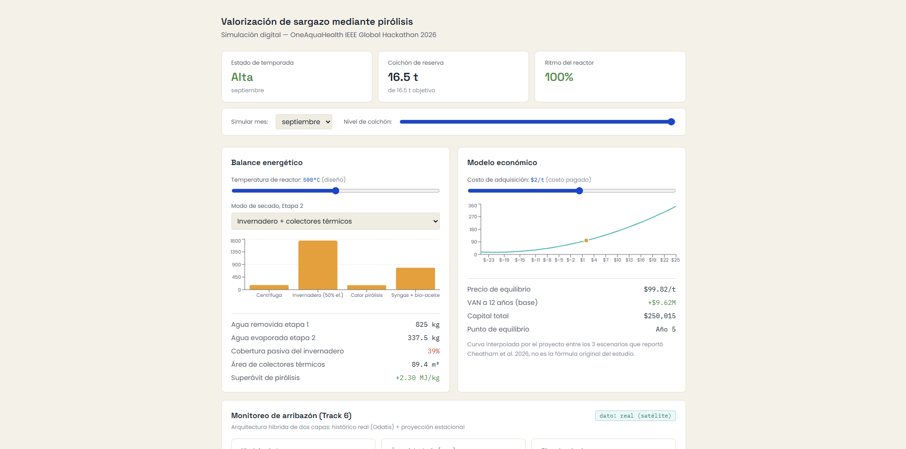

# PYRO-CELL

**A digital simulation of a coastal circular-economy pipeline that turns Sargassum seaweed into biochar, energy, and clean water, while protecting the aquatic ecosystems the OneAquaHealth mission exists to defend.**

## Inspiration

Sargassum blooms are not just a beach nuisance. As the mats decompose on the shore, they drive hypoxia and eutrophication in coastal waters, release hydrogen sulfide, and can leach arsenic and heavy metals into the water column, the same water OneAquaHealth's "Healthy Waters, Healthy Ecosystems, Healthy Communities" mission is built to protect. 2026 is already a near-record bloom year across the Atlantic and Caribbean.

We started this project asking a narrower question, whether a pyrolysis pipeline for Sargassum could be energy self-sufficient. It became a broader one once we realized the real judge-facing story is not energy for its own sake: it is that removing the biomass before it decomposes is itself a water-protection intervention, and the energy design is what makes that intervention operationally sustainable rather than a one-off cleanup.

## What it does

PYRO-CELL is a client-side simulation dashboard, not a physical prototype, that models a full valorization pipeline from wet, freshly-harvested Sargassum to biochar, syngas, bio-oil, and a candidate water-treatment product, with every number traceable to a cited source or explicitly marked as our own estimate.

**Five modules, all live in the deployed app:**

- **Energy balance**: mass and thermal balance across mechanical dewatering (centrifuge), passive solar drying (greenhouse + evacuated-tube thermal collectors), and pyrolysis. Reactor temperature is a single shared slider (400-600°C) that now drives both the energy module and the economic module together, closing a disconnect we found and fixed mid-build.
- **Economic model**: NPV, breakeven price, and a sensitivity slider on Sargassum acquisition cost, interpolated from the three scenarios published in Cheatham et al. (2026), not a black box.
- **Seasonality**: a month and reserve-buffer simulator implementing our own hybrid supply strategy (partial buffer, reduced-rate operation in the scarcity core), since Sargassum arrival is seasonal and the original design assumed a constant year-round feed.
- **Resilience monitoring (Track 6)**: a two-layer hybrid, a real offline snapshot of Météo-France/CNRM satellite Sargassum detection data (Odatis, DOI 10.12770/1eb82d09) calibrated against a seasonal projection layer. No live network dependency, so the demo can never fail from an external outage, and the UI always labels which layer produced the number on screen.
- **AI-assisted validation (Track 3)**: a Vercel Edge Function that evaluates simulated citizen observations of Sargassum sightings using Groq (an open-weight model, since the team does not have Claude API access), with structured-output reasoning, deterministic pre-checks, and a human-in-the-loop review flag whenever confidence is low or an anomaly is detected. This is explainable AI in the literal sense the track asks for, not a black-box classifier.

## How we built it

Frontend is React + Vite + TypeScript + Tailwind v4 + Recharts, deployed to Vercel. All physical and economic constants live in one typed module (`src/lib/constants.ts`), each with a source comment, so the UI can never silently drift from the research behind it.

Independent of the web app, we modeled the physical process and plant layout in MATLAB: a mass and energy balance script (`sargazo.m`, `constantes.mlx`) and a 3D plant layout (`plano.m`) covering intake and centrifuging, the solar drying stage, the pyrolysis reactor with a CSP/syngas hybrid heating architecture, and a biochar filter bank for water treatment, including a thermal regeneration loop back into the reactor for spent filter media.

## Challenges we ran into

- **A unit mismatch that inflated our own syngas energy by roughly 6x.** An early MATLAB script multiplied a per-kg-of-syngas HHV directly by total dry mass without applying the syngas mass yield first. We caught it by recomputing independently and comparing against our own already-verified figures.
- **A silent architectural gap between the energy and economic modules.** The economic model let a user slide reactor temperature from 400 to 800°C, but the energy module was hard-coded to Milledge et al.'s 400°C figures regardless. We only found this because a MATLAB plant sketch forced a single concrete biochar-yield number, which made the mismatch impossible to ignore. Fixed by making pyrolysis heat a function of temperature and reconciling both modules to a shared 400-600°C design range.
- **A moisture-basis error that had been silently propagating for days.** We had been modeling the process at 80% initial moisture; the actual figure in Cheatham et al. (2026), and in our own team's MATLAB constants file, is 82%. That two-point difference cascades through every downstream number (water removed, energy required, collector area, buffer size). We traced and corrected it everywhere once it surfaced.
- **A plant sketch that would not even parse.** An early version of `plano.m` had an unclosed `for` loop that made the script fail before drawing anything, plus a cylinder with its height and radius axes accidentally swapped, rendering the pyrolysis furnace as a flattened disc instead of a vertical reactor. We installed Octave in our build environment specifically to execute and visually verify the fix rather than trust a code read.
- **Realizing our own arsenic warning cuts both ways.** We had flagged that sargassum bioaccumulates arsenic, a risk for biochar used in soil or construction. Researching biochar as a water filter surfaced literature showing sargassum-derived biochar (particularly iron-oxide-modified) can adsorb arsenic from water, but no study we found tests whether *our* biochar's own bioaccumulated arsenic leaches back out under filtration conditions. We are treating that as an open safety question requiring a real leaching test, not an assumption either way.

## Accomplishments we're proud of

- A real satellite-data pipeline (not a placeholder): our extraction script pulled genuine daily Sargassum detection data from the Ifremer/CERSAT archive for the Mexican Caribbean box, and in doing so found that the real observed bloom peak is July-August, not June-July as the secondary sources we started with assumed.
- A working, structured-output AI validation endpoint with a real fallback chain (structured JSON, then free-text parsing, then a safe human-review default), not a demo that only works on the happy path.
- A fully reconciled physical and economic model, three separate design decisions (moisture basis, greenhouse efficiency, reactor temperature) made explicitly and propagated consistently through every document and every constant in the codebase, with the disagreements between our own sources documented rather than hidden.

## What we learned

Pre-treatment dominates the energy budget far more than the reactor itself: mechanical dewatering and passive solar drying determine whether the whole pipeline is energy-positive, long before pyrolysis chemistry matters. And research rigor has a compounding return: nearly every "small" correction in this build (a unit error, a moisture basis, a temperature mismatch) was only caught because an earlier verification habit made the next inconsistency visible.

## What's next for PYRO-CELL

- A real leaching test on our own biochar before treating the water-filter application as validated, not just adsorption-capable.
- Actual reactor engineering sizing (volume, residence time) for the throughput we model; our current 3D plant sketch uses illustrative dimensions, not a calculated vessel.
- Sizing the CSP field and off-gas treatment for thermal regeneration of spent filter biochar, since some adsorbed metals can volatilize at regeneration temperatures.
- Revenue-model update: current economics use a $100/t biochar baseline for comparability with Cheatham et al.; the 2026 market (certified biochar plus carbon credits) trades at $400-1,200/t physical and $150-400/tCO2e, pending the characterization work certification requires.
